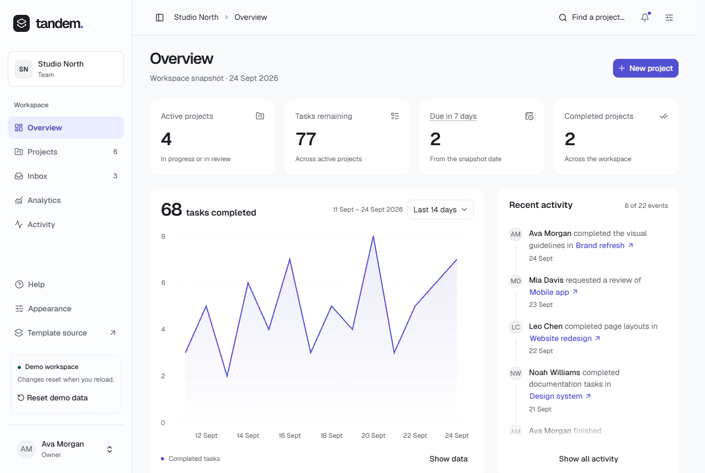

# Groundwork

A reusable [shadcn/ui](https://ui.shadcn.com) kit for public websites and admin interfaces, with centralized design tokens, content-free shells and a complete reference demo that shows every pattern working in context.



The repository has two parts:

- **The kit** (`src/kit/`) is what you copy into your own projects: shadcn primitives with Base UI, data-table controls, a rich-text editor, public and workspace shells, the theme runtime and one token file.
- **Tandem** (everything else) is a fictional product that exercises the kit end to end. It covers public pages, a project workspace, access flows, settings and a reference library.

Tandem's data, authentication, billing, email and integrations are local demonstrations with no production services. Changes survive navigation but reset on reload.

## What the demo covers

- **Public site:** Home, Product, Pricing, Blog, Changelog, Help, Contact and legal pages.
- **Workspace:** Overview, Analytics, Inbox, Activity and Projects (Table, Cards and Board views, rich descriptions, details, editing, bulk actions); account, workspace, team, billing and developer settings.
- **Access:** password, email-link and provider sign-in demos, recovery, MFA and onboarding.
- **Reference library:** searchable component and pattern catalogues with source, a theme playground with import/export and saved presets, and state scenarios.

## Run it locally

Requires Node.js 24 and npm 11.

```sh
npm ci
npm run dev
```

Open `http://127.0.0.1:5173`. The root opens the public site; **Open demo** enters the workspace. The demo clock is fixed at 24 September 2026, so examples stay repeatable.

## Use the kit in your project

The kit assumes React 19, Tailwind CSS 4 and a `@/` path alias to your source folder.

1. Install it with the shadcn CLI. The repository is a [GitHub registry](https://ui.shadcn.com/docs/registry/github), so no setup is needed:

   ```bash
   npx shadcn add ossianravn/groundwork/kit
   ```

   That installs everything into `src/kit/`, the same layout as this repository, so the kit's own imports keep working, and adds its npm dependencies. To take only what you need, install `ossianravn/groundwork/base` (tokens, styles, theme runtime) plus parts such as `button`, `data-table`, `rich-text`, `shell` or `theme-panel`; each part brings the parts it uses. `npx shadcn list ossianravn/groundwork` shows them all. Pin a release with its tag, such as `ossianravn/groundwork/kit#v0.1.1`; from v0.1.1 on, every part the item brings is pinned to the same release.

2. Or copy `src/kit/` into your project's source folder and install what it imports:

   ```sh
   npm install @base-ui/react class-variance-authority cn culori lucide-react tw-animate-css shadcn @fontsource-variable/geist @fontsource-variable/inter @fontsource-variable/source-sans-3
   ```

   Add these only for the parts you use: `@tanstack/react-table` (data tables), `@tiptap/core @tiptap/pm @tiptap/react @tiptap/starter-kit @tiptap/static-renderer` (rich text), `recharts` (charts), `cmdk` (command menu), `react-resizable-panels`, `input-otp` and `@shadcn/react`.

3. Make `kit/styles/kit.css` your Tailwind entry (or `@import` it from yours), and point `components.json` at it so `npx shadcn add` installs into `kit/ui`.
4. Apply saved appearance before rendering, and provide tooltips:

   ```tsx
   import { applyTheme, readTheme } from "@/kit/theme/preferences"
   import { TooltipProvider } from "@/kit/ui/tooltip"

   applyTheme(readTheme())
   // render your app inside <TooltipProvider>
   ```

5. Render a shell with your own brand, navigation and router link. `src/app/demo-workspace-shell.tsx` and `src/components/tandem-public-layout.tsx` show complete examples. Shells never import a router: you pass a `LinkComponent` that resolves the destinations you name.

## Customize

| To change | Edit |
| --- | --- |
| Colors, type scale, spacing, radius and density | `src/kit/styles/theme.css`, the only file that defines token values |
| Responsive and pointer-specific token values | `src/kit/styles/responsive.css` |
| A primitive's appearance | Its component in `src/kit/ui/`; primitives style themselves with token-based classes |
| Accents (the shipped color options) | `src/kit/theme/accents.ts` for the name and order, plus a light and a dark `[data-accent]` block in `theme.css`; a test fails if the two disagree |
| Interface fonts | `src/kit/theme/fonts.ts` and `src/kit/styles/fonts.css`; keep each font's license in `public/font-licenses/` |
| Brand in every shell | `src/components/tandem-brand.tsx` (demo) or your own `ShellBrand` |

The theme playground at `/reference/themes` previews these tokens on real pages, generates a palette from one brand color and exports presets. To move a theme into another Groundwork project, export it as a shadcn registry item (Import / export → shadcn), save the JSON in that project's root and run:

```bash
npx shadcn add ./your-theme.json
```

The CLI writes `src/kit/styles/themes/your-theme.css` and imports it from `kit.css`, after the kit tokens. Run your formatter afterwards: the CLI rewrites `kit.css` without its final newline. An installed theme sets the brand for every accent, so either drop the accent choice from Appearance or add the theme to `src/kit/theme/accents.ts` as an accent instead.

## Project layout

| Path | Contents |
| --- | --- |
| `src/kit/` | The reusable kit: `ui/`, `data-table/`, `rich-text/`, `shell/`, `theme/`, `lib/`, `styles/` |
| `src/components/` | Tandem's brand, shell content and domain components |
| `src/features/` | Page views, which receive data and callbacks |
| `src/demo/` | Fixtures and local demo state |
| `src/app/` | Routes and host bindings (TanStack Router) |
| `src/styles/` | Demo stylesheets, loaded after the kit's |
| `docs/` | Design system, UX and quality rules, page specifications |

The kit's independence is enforced: ESLint rejects kit imports from demo code or the router, and `src/kit/kit-boundary.test.ts` checks kit stylesheets for demo classes, global primitive overrides and duplicated tokens. See [code boundaries](docs/design-system.md#code-boundaries).

## Checks

```sh
npm run lint
npm run typecheck
npm test
npm run build
npm run format:check
```

`registry.json` is generated from the kit: run `npm run registry` after adding, removing or re-importing kit files, and `npm test` fails while it is stale. `npm run release -- <version>` cuts a release: it tags a commit whose registry pins every dependency to that tag (shadcn does not pass a tag on to dependencies), then unpins `main` again.

`npm run preview` serves the production build. Hosting must serve `index.html` for application routes. The `Dockerfile` does this: it builds the site and serves it with nginx on port 80 (`deploy/nginx.conf`), so any Docker host, such as Dokploy or Coolify, can deploy the repository directly. Optional browser checks, including a computed-style snapshot for refactors, are described in [tools/verification](tools/verification/README.md).

## Documentation

Start with the [specification overview](docs/README.md). The [design system](docs/design-system.md) owns styling rules, [UX decisions](docs/ux-decisions.md) and the [quality contract](docs/quality.md) own interaction and accessibility, and [framework portability](docs/framework-portability.md) covers adopting the views outside Vite and TanStack Router; Next.js and TanStack Start integrations are untested.

## Contributing

See [CONTRIBUTING.md](CONTRIBUTING.md). Coding agents also follow [AGENTS.md](AGENTS.md).

## License

[MIT](LICENSE). Bundled fonts and provider marks keep their own licenses: see `public/font-licenses/` and `src/assets/brands/README.md`. Tandem, its workspace and its people are fictional.
